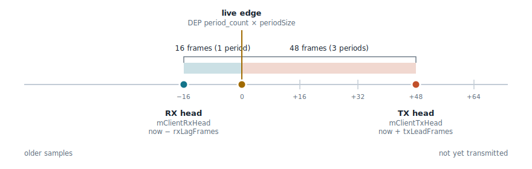

# Dante DEP Client SDK

A C++ client SDK for the Audinate DEP (Dante Embedded Platform) shared-memory audio API.

## Contents

```
include/dante/DanteAudio.hpp        — public API (single header)
lib/x86_64-linux/libDanteAudio.a    — prebuilt static library, x86_64
lib/aarch64-linux/libDanteAudio.a   — prebuilt static library, aarch64
cmake/libDanteAudio.cmake           — CMake integration for consumers, arch-selecting
docs/txlead-rxlag.svg               — TX lead / RX lag diagram
```

This repo ships prebuilt libraries only, one per supported platform. Source, the relay
daemon, and diagnostic tools are developed elsewhere; this is the published artifact
consumers build against.

## Using the SDK (consumers)

Include `cmake/libDanteAudio.cmake` and link against the `DanteAudio` target:

```cmake
include(path/to/Dante-DEP-Client-SDK/cmake/libDanteAudio.cmake)

target_link_libraries(MyApp PRIVATE DanteAudio)
```

This gives `MyApp` the include path for `<dante/DanteAudio.hpp>` and links
`libDanteAudio.a` with its `pthread` and `rt` dependencies.

**Important**: a process using `DefaultBufferContext::wait()` requires `dep_sync_fanoutd`
to be running on the target — it bridges the DEP POSIX semaphore into a futex broadcast,
allowing any number of clients to block on `period_count` simultaneously.

## TX lead / RX lag



`BufferBlockAccessor` reads and writes against DEP's shared-memory ring, which advances
one period at a time regardless of when your process actually gets scheduled. Two
`BlockAccessorConfig` fields control how far your read/write cursors sit from that live
position:

```cpp
Dante::BlockAccessorConfig config(txLeadUs, rxLagUs);  // both in microseconds
```

- **`txLeadUs`** (default `1000`) — keeps the write cursor ahead of the live edge, so a
  late write never collides with data DEP is about to transmit.
- **`rxLagUs`** (default `0`) — keeps the read cursor behind the live edge, giving DEP's
  own write a settling margin before you read it.

Both are one-way added latency, not free safety margins — raise them only as far as your
scheduling jitter actually requires. Same concept as `snd_dep_alsa`'s `tx_lead_us`/
`rx_lag_us` module parameters, for anyone tuning both.
